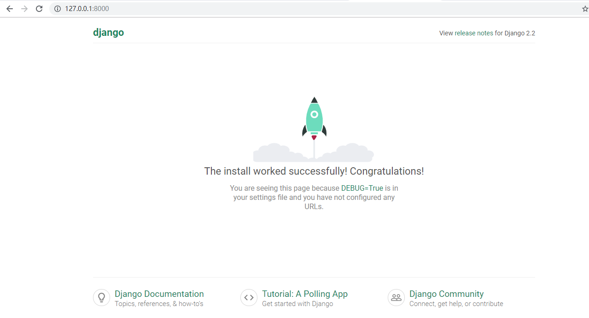

# 说明
  - 本地开发系统：windows 10。
  - Python版本：python3.7.3。
  - Django版本：django2.2.4。
  - 使用的命令行工具是git bash.
  - 因为系统等原因，使用命令行操作时，python有时候需要替换成python3, pip有时候需要替换成pip3。
  - 本次开发项目依赖库汇总(按安装的顺序)：
  ``` 
  python3.7.3， django2.2.4, 
  ```
# 安装 python
python下载地址：https://www.python.org/downloads/,选择合适的版本进行安装。
验证安装结果：
```
> python3 --version
Python 3.7.3
```
# 创建项目虚拟环境
这里使用python自带的[venv](https://docs.python.org/3/library/venv.html)创建虚拟环境。示例(在D盘下面新建名为venv的虚拟环境)：
```
> python3 -m venv ./venv
```
# 安装Django
为了将Django安装到之前新建的虚拟环境中，需要激活虚拟环境。windows系统下，进入D:\venv\Scripts>目录，然后输入activate命令激活虚拟环境。
```
D:\venv\Scripts>activate  
(venv) D:\venv\Scripts>  
```
激活虚拟环境后，安装Django:
```
(venv) D:\venv\Scripts>pip install django
```
验证Django安装：
```(venv) D:\venv\Scripts>python3
Python 3.7.3 (v3.7.3:f59c0932b4, Mar 28 2018, 17:00:18) [MSC v.1900 64 bit (AMD64)] on win32
Type "help", "copyright", "credits" or "license" for more information.
>>> import django
>>> django.get_version()
'2.2.4'
```
# 创建项目
这里使用django-admin命令创建项目(项目名为mysite)。
```
(venv) D:\>django-admin startproject mysite
```
# 创建应用及其设置
进入到mysite目录，在mysite目录下新建一个目录apps,用于存放所有的应用。然后进入到apps目录，使用python manage.py startapp 命令创建一个名为blog的应用。
注：也直接在mysite目录下创建blog应用。
```
(venv) D:\>cd mysite
(venv) D:\mysite>mkdir apps
(venv) D:\mysite>cd apps
(venv) D:\mysite\apps>python ../manage.py startapp blog
```
 - 设置1.将apps目录所在的路径添加到sys.path路径中，这样Django寻找应用的时候才可以找到。
 D:\mysite\mysite\settings.py
 ```
import sys
sys.path.insert(0, os.path.join(BASD_DIR, 'apps'))
 ```
 - 设置2：将blog应用添加到INSTALLDD_APPS
 ```
INSTALLDD_APPS = [
    # 已添加的应用此处省略不写，而不是删除。
    'blog',
]
```

# setting文件设置
mysite/mysite/setting.py
 - 设置语言
    ```
    LANGUAGE_CODE = 'zh-hans'
    ```
 - 设置区时
    ```
    TIME_ZONE = 'Asia/Shanghai'
     ```
  - 设置mysql数据库 <br/>
    使用mysql数据库需要安装两个依赖：pymysql， mysqlclient。
    ``` 
    (venv) D:\mysite>pip install pymysql
    (venv) D:\mysite>python -m pip install --upgrade pip
    ```
    配置数据库为mysql数据库
    ``` 
    'default': {
    'ENGINE': 'django.db.backends.mysql',
    'HOST': '127.0.0.1',
    'PORT': '3306',
    'USER': 'root',
    'PASSWORD': '123456',
    'NAME': 'mysite',
    }
    ```
 - 设置日志
   ``` 
    WORK_PATH = os.path.abspath(os.path.dirname(__file__))
    PRJ_NAME = os.path.split(WORK_PATH)[-1]
    LOG_PATH = "/var/log/mysite/%s.log"%PRJ_NAME

    if os.name != "posix": # 针对linux环境设置
        LOG_PATH = os.path.join(WORK_PATH,"%s.log"%PRJ_NAME)
    
    LOGGING = {
        'version': 1,
        'disable_existing_loggers': False,
        'formatters': {
            'verbose': {
                'format': 'cdoter %(levelname)s %(asctime)s %(module)s %(funcName)s %(lineno)d %(message)s'
            },
            'simple': {
                'format': 'cdoter %(levelname)s %(message)s'
            },
        },
        'handlers': {
            'mail_admins': {
                'level': 'ERROR',
                'class': 'django.utils.log.AdminEmailHandler'
            },
            'file': {
                'level': 'DEBUG',
                'class': 'logging.FileHandler',
                'formatter': 'verbose',
                'filename':LOG_PATH,
            },
        },
        'loggers': {
            'django.request': {
                'handlers': ['mail_admins', 'file'],
                'level': 'ERROR',
                'propagate': True,
            },
            'default': {
                'handlers': ['file'],
                'level': 'DEBUG',
                'propagate': True,
            },
        }
    }  
   ```
 # 启动项目
 django 启动项目使用python manage.py runserver命令，默认端口号为8000。
 ``` 
 (venv) D:\mysite>python manage.py runserver
 ```
 打开浏览器访问http://127.0.0.1:8000/,如果出现以下图片，表示创建启动项目成功。
 
 
 # 部署相关配置
 这些配置是部署的时候用到的，如果仅仅是在本地开发，可以不操作这些配置。
 <br/>mysite/mysite/settings.py
 - DEBUG
 ```
DEBUG = False
```
- STATIC_ROOT
``` 

```
 


