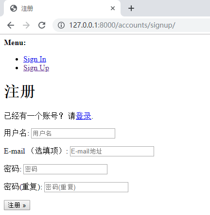

# 说明
  - django-allauth
    - 主页：https://www.intenct.nl/projects/django-allauth/
    - 源码：https://github.com/pennersr/django-allauth
    - 文档：https://django-allauth.readthedocs.io/en/latest/
# 创建user应用
创建名为user的应用(application),用于处理跟用户相关的请求。
 - 创建
    <br/>mysite/apps/
    ```   
    $ python3 ../manage.py startapp user
    ```
 - 将应用添加到INSTALLED_APPS
    <br/>mysite/mysite/settings.py
    ```   
    INSTALLED_APPS = [
          'user',
    ]
    ```
   
# django-allauth
  为了方便，认证与鉴权功能使用的是第三方库django-allauth。
  - 安装
      ``` 
      $ pip3 install django-allauth
      ```
  - 配置
    - INSTALLED_APPS中新增应用
        <br/>mysite/mysite/setting.py
        ``` 
         INSTALLED_APPS = [
            'django.contrib.sites', # 因为allauth对于站点设置django.contrib.sites有依赖，所以也把它加入进去
            'allauth',
        ]
        ```
    - 设置SITE_ID
      <br/>mysite/mysite/setting.py
      ``` 
      SITE_ID = 1
      ```
    - 设置路由
       <br/>mysite/mysite/urls.py
      ``` 
       from django.urls import path, include
       urlpatterns = [
            path('accounts/', include('allauth.urls')),
       ]
      ```
  - 数据库迁移
    <br/>pycharm terminal命令窗口操作
    ``` 
    (venv) D:\mysite>python3 manage.py migrate
    (venv) D:\mysite>python3 manage.py migrate
    ```
  - 启动服务器
    <br/>pycharm manage.py@mysite命令窗口操作
    ``` 
    manage.py@mysite > runserver
    ```
  - 访问注册页面
    ``` 
    http://127.0.0.1:8001/accounts/signup/
    ```
    页面如下图所示：