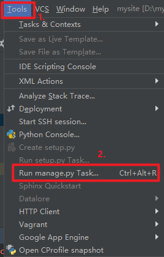
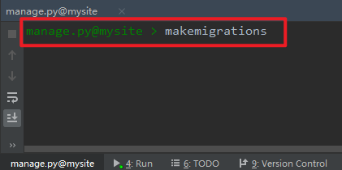

# 说明

- 命令行操作是在git bash客户端进行。

- 默认全部操作都是在激活虚拟环境的情况下进行。

因为django自带的USER模型并不能满足实际的开发需求，所以需要扩展USER模型，增加一些新的字段。
# 一、创建USER模型
mysite/apps/user/models.py：

``` 
# -*- coding:utf-8 -*-
from django.db import models
from django.contrib.auth.models import AbstractUser


class USER(AbstractUser):
    """用户

    """
    link = models.URLField(verbose_name='个人网址')

    class Meta:
        db_table = 'user'
        ordering = ['-id']
        verbose_name = '用户'
        verbose_name_plural = '用户'

    def __str__(self):
        return self.username
```
# 二、设置AUTH_USER_MODEL 
因为扩展了USER，所以需要添加自定义认证用户模型。
mysite/mysite/settings.py：

```
AUTH_USER_MODEL='user.USER' # user是应用名，USER是模型名
```
# 三、生成数据库迁移(migrations)

以下两种方式任选其中一种方式操作即可。

## 1、方式一：pycharm操作

（1）依次点击Tools > Run manage.py Task



（2）创建数据库迁移

```
manage.py@mysite >makemkgrations
manage.py@mysite >migrate
```



## 2、方式二：命令行操作

mysite/

```
$ python manage.py makemigrations
$ python manage.py migrate
```