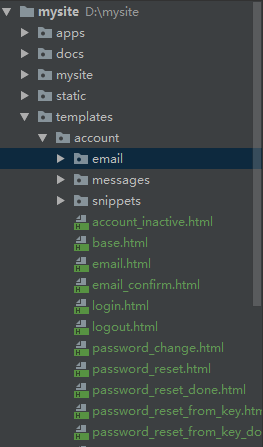

# 说明
# 创建static目录
   static用于存放静态文件，如css, js, image等。同时分别在static目录创建css, img, js目录。
   <br/>mysite/
   
    ``` 
    $ mkdir static
    $ cd static
    $ mkdir css
    $ mkdir js
    $ mkdir img
    ```
# 创建templates目录
templates目录用于存放模板文件(index.html)。
<br/>mysite/
  ``` 
  $ mkdir templates
  ```
# 拷贝django-allauth模板文件
登录注册界面也是使用django-allauth提供的模板。但是原来的模板过于简单，需要完善一下。怎么完善呢？在项目中创建同名的
模板文件即可覆盖djano-allauth提供的模板
（详见参考资料:https://django-allauth.readthedocs.io/en/latest/templates.html#overridable-templates）。
  - 下载django-allauth
  <br/>访问django-allauth的github: https://github.com/pennersr/django-allauth/tree/master/allauth，然后将
  整个项目克隆到本地或者下载zip文件到本地。
  - 将account目录拷贝到templates目录中
  <br/>
  将djano-allauth的account目录（路径：django-allauth-master\allauth\templates\account）和base.html文件
  （路径：django-allauth-master\allauth\templates\base.html）拷贝到项目的templates目录。<br/>
  
# 首页开发

  


